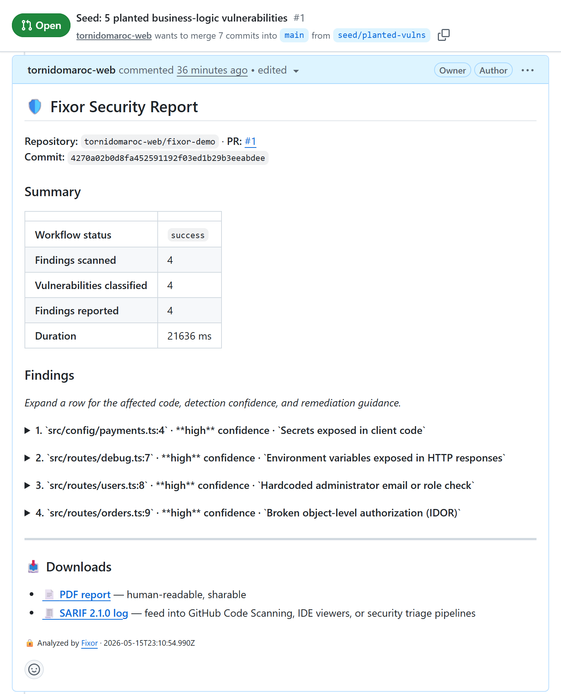

<div align="center">


<br/>

[](https://github.com/apps/fixor-security/installations/new)
[](https://anthropic.com)
[](LICENSE)

> **Detects 6 business-logic vulnerability classes in Node/TypeScript: auth bypass, missing admin gates, IDOR, environment-variable exposure, hardcoded secrets, and unverified webhooks.**

[Landing](https://tornidomaroc-web.github.io/fixor/) ·
[Dashboard](https://app.fixor.dev) ·
[Docs](https://docs.fixor.dev) ·
[Status](https://status.fixor.dev) ·
[Security](https://tornidomaroc-web.github.io/fixor/security.html)

</div>

---

## What Fixor does today

| Capability | Status |
|---|---|
| 🔓 Authentication bypass — weakened or short-circuited auth checks: role-to-admin fallbacks, swallowed token verification, hardcoded bypass flags | ✅ Shipping (measured) |
| 🔑 IDOR — resource access without an ownership check | ✅ Shipping (measured) |
| 👮 Weak admin check — privilege gated by hardcoded email/role allowlists or client-supplied role | ✅ Shipping (measured) |
| 🌫️ Env exposure — secrets leaked through env vars into response bodies | ✅ Shipping (measured) |
| 🗝️ Secrets exposure — hardcoded API keys, tokens, credentials | ✅ Shipping (measured) |
| 🪝 Unverified webhook handlers — handlers that skip signature verification. URL-name prefilter (router-style frameworks only) plus content-based lib-import / anti-pattern prefilter (any framework; see [`docs/detector-capabilities.md`](docs/detector-capabilities.md) for content-prefilter blind spots). Provider fixtures: Stripe / GitHub / Twilio / Slack / Lemon Squeezy / custom-HMAC | ✅ Shipping (measured) |
| 📄 Branded PDF report per PR (signed Cloudinary URL, 1h TTL) | ✅ Shipping |
| 📊 SARIF output (linked from PR comment, drops into Code Scanning et al.) | ✅ Shipping |
| 🔌 Native GitHub App — HMAC webhook, ≤1h installation tokens | ✅ Shipping |
| 💳 Paddle billing — free / $29 / $199, hosted checkout + portal | ✅ Shipping |
| 🎛️ Dashboard — scan history, trends, settings, billing | ✅ Shipping |
| 💸 Per-org Anthropic budget cap — 80% nudge + hard pause at 100% | ✅ Shipping |
| 🏗️ Framework scope — route-shape detection covers router-style (`router.METHOD(path, ...)` — Express family) AND Next.js App Router method-named exports (`export const POST = ...` / `export async function GET(...)`) AND Remix v2 file-system-routed handler exports (`export const loader = ...` / `export const action = ...`, added Phase E 2026-05-23). App Router calibration measured against inbox-zero: 182 of 228 routes scanned (~80%, PARTIAL scan, halted for API budget — not a full-corpus sweep): 0 auth-bypass / 0 admin-check findings on the scanned 182, plus 2 webhook findings of documented-limitation classes. Phase F (2026-05-23) lifted the cross-file verifier helper class (c) and the non-HMAC shared-secret challenge class (d) from HIGH to MEDIUM/review-queue. Phase F's first cut left a window-truncation residual on class (c) (apple/webhook stayed HIGH because the verifier call sat outside the windowed payload); the follow-up structural fix later that day (PR #71) switched the webhook detector to whole-file context for App Router route-def triggers, matching the discipline already in place for auth-bypass and admin-check. Both real-world inbox-zero routes now drop to MEDIUM/review-queue: outlook/webhook on the verification-suggesting import path, apple/webhook on the verify*Payload cross-file helper name convention now visible in whole-file context. The two classes are fully lifted — no remaining apple-shape residual. **Remix coverage (Phase E):** sibling `REMIX_HANDLER_DEF_RE` matches `export const loader|action`, bounded by an `isRemixRoutePath` path-aware filter (`/routes/` segment or `app/root.{ts,tsx}`) so utility modules under `app/lib/` / `app/utils/` that happen to export `loader`/`action` factories are not misrouted to the LLM. Calibrated against 17 Remix fixtures (auth-bypass 6 + admin-check 6 + webhook 5, including over-match utility anchors), all passed; planted-vuln demo (fixor-demo-remix) flagged 3 planted Remix-shape vulnerabilities with correct detector attribution and reasoning that explicitly named "Remix `action` export". **Two named residuals on the Remix claim:** (i) **real-world production-corpus baseline against a Remix codebase (e.g. Trigger.dev's 411 routes) is deferred** — calibration + demo were scientifically sufficient under the Phase D partial-sample discipline; (ii) **non-conventional wrapper-name divergence on unknown Remix codebases is a known residual** until a real corpus is measured — the path-aware filter bounds (does not eliminate) the divergence class. **Cross-file parent-layout guard (Phase G, 2026-05-28):** auth-bypass and admin-check now recognize a route gated by an ancestor `_layout.tsx` loader and suppress that cross-file false positive — **for Remix / React Router v7 only**, only on structurally PROVEN `+`-folder coverage with a blocking layout loader, and only for read/loader concerns (never a destructive `action`). Validated on the real Documenso clone (3/3 admin read routes: FP before, cleared after). **App Router cross-file auth (middleware matchers, `layout.tsx` / DAL gating) remains a named limitation, addressed in a later phase** — an App Router `layout.tsx` does not wrap Route Handlers, so its coverage is not structurally provable. See [`docs/detector-capabilities.md`](docs/detector-capabilities.md) for the four documented webhook limitations, the unfamiliar-wrapper MEDIUM-confidence review-queue UX, and the deferred Remix baseline. | 🟢 App Router · 🟢 Remix |
| 🐍 Python · 🐹 Go — IDOR, env-exposure, secrets-exposure, and webhook-unverified detect cross-language today; auth-bypass and admin-check catch their sentinel/hardcoded shapes cross-language. **auth-bypass, admin-check, and IDOR route-shape now cover FastAPI / Flask-2.0 `@app.METHOD` / `@router.METHOD` decorators (Python slices 1 + 1b, 2026-05-28)** — in-file `Depends`/`Security` name-convention recognition (auth for auth-bypass; `admin`/`superuser`-substring for admin-check, where plain `get_current_user` is NOT sufficient), plus the idiomatic FastAPI typed-path-param IDOR source + SQLAlchemy-2.0 `session.get` sink; all lang-gated to `.py`. Validated on the real `full-stack-fastapi-template`: guarded/admin-gated/ownership-checked routes cleared, the authless `private.py` route flagged. **FastAPI route-shape is now complete across all three route-shape detectors.** Cross-file Depends + conditional/router-level mounting remain a named slice-2 limitation; Flask-classic and Django are later slices (see [`docs/detector-capabilities.md`](docs/detector-capabilities.md)). Go route-shape and Express/App-Router/Remix remain as before | 🟡 Partial (FastAPI route-shape complete; Flask/Django pending) |
| 💎 Ruby — limited (auth-bypass and IDOR fixtures only) | 🟡 Partial |
| ☕ Java · 🐘 PHP — first-class detectors planned | 🚧 On roadmap (Phase 6) |
| 🤖 Auto-fix Pull Requests (commit back) | 🚧 On roadmap (Phase 6) |

The full plan and what's already shipped is in [`docs/INDIE-SAAS-ROADMAP.md`](docs/INDIE-SAAS-ROADMAP.md).

## How it works

1. Install Fixor as a GitHub App on a repo or org.
2. When a PR opens or updates, GitHub sends a signed webhook to Fixor.
3. The diff (only the changed lines — never the full repo) is sent to Claude.
4. Fixor's analysis engine produces findings, each with a precise explanation and remediation steps.
5. A structured comment lands on the PR with the report inline + signed PDF/SARIF links.

Total latency from PR push to comment: typically 10–30 seconds.

> **A second pair of eyes, not a guarantee.** Every finding Fixor reports comes with a precise explanation and remediation steps, so you can judge it quickly. It sharpens human review; it does not replace it.

## Screenshots

A live Fixor Security Report, posted on a real pull request — [`fixor-demo` PR #1](https://github.com/tornidomaroc-web/fixor-demo/pull/1):



<!-- TODO: capture remaining assets, then uncomment -->
<!--  -->
<!--  -->

## Compared to Snyk and Semgrep

Fixor doesn't compete with Snyk or Semgrep — it covers the class they structurally can't. CVE scanners and pattern matchers are strong on dependency vulns and known injection sinks (SQLi, XSS); they are blind to business-logic flaws, because catching those needs reasoning about auth, ownership, and role semantics — not patterns. **Run Snyk for dependencies, run Fixor for the logic in your own code.**

| | **Fixor** | Snyk Code | Semgrep (OSS / Pro) |
|---|---|---|---|
| Setup time | Install GitHub App, done | CLI / CI step + dashboard config | Add `.semgrep.yml` + CI step |
| Languages | JS/TS full · partial Python/Go/Ruby | 10+ | 30+ |
| Detector focus | Business logic: auth-bypass · IDOR · admin-check · env-exposure · secrets · unverified-webhooks | Dependency CVEs + injection patterns | 2,000+ pattern rules |
| False-positive driver | Claude reasoning per finding | Heuristics + ML | Pattern rules (highest precision when written; brittle on edge cases) |
| Remediation output | Precise explanation + remediation steps per finding | Partial auto-patch (Snyk Code Fix) | Rule message only |
| PDF + SARIF | ✅ Both | ✅ SARIF | ✅ SARIF |
| Pricing (entry) | $0 (free tier, real) | Free tier; $52/dev/mo Team | OSS free; $40/dev/mo Pro |
| Open source | ✅ MIT | ❌ | ✅ rules engine |
| Best for | Catching logic flaws in your own JS/TS code | Dependency + known-CVE coverage | Teams who want full rule control |

If you're at a 50-person company with a polyglot codebase, Snyk or Semgrep Pro is probably the right call. If you're a solo founder or a small team shipping a Node.js app and want a security review on every PR with zero ceremony, Fixor is built for you.

## Self-hosting

Fixor is MIT-licensed; you can run the entire stack yourself. The hosted service exists because most operators don't want to run Postgres, manage GitHub App keys, and pay Anthropic directly — but if you do, the path is:

```bash
git clone https://github.com/tornidomaroc-web/fixor.git
cd fixor
npm ci
cp .env.example .env        # fill in credentials per inline docs
npm run build
npm run db:migrate          # apply schema to your Postgres
npm start                   # webhook server on $PORT
```

Requires Node.js ≥ 20, a registered GitHub App, an Anthropic API key, a Postgres database (we use Neon; any Postgres works), and a Cloudinary account for report hosting. Optional: Sentry DSN for error tracking, Resend for transactional email, Paddle for billing if you want the same paid tiers as the hosted service.

The dashboard is a separate Next.js app at [`apps/dashboard/`](apps/dashboard/) — see its `.env.example` for the Vercel-side requirements (Clerk, the same Postgres URL, Paddle public token).

## Tech stack

| Layer | Tech | Why |
|---|---|---|
| Runtime | Node.js 20 + TypeScript 5 | Boring, fast, well-supported |
| AI | Claude (Anthropic SDK with prompt caching + tool use) | Reasons about diff context; lower FP rate than regex |
| Database | Neon Postgres + Drizzle ORM | Serverless, branching, type-safe |
| Auth (App) | GitHub App — RS256 JWT + ≤1h installation tokens | Standard for App-based GitHub integrations |
| Auth (Dashboard) | Clerk — GitHub OAuth only | 10k MAU free, OOTB |
| Backend host | Railway | Cheap, fast deploys, fits indie budget |
| Frontend host | Vercel + Next.js 16 + Tailwind 4 | Standard for Next.js |
| Logger | Pino with redaction for keys + secrets | JSON, fast, lint-banned `console.*` outside scripts |
| Errors | Sentry | Free 5k events / month |
| Payments | Paddle (merchant of record — handles VAT) | Stripe alt; geo-friendly |
| Email | Resend | 100/day free; transactional only, no marketing |
| Object storage | Cloudinary (signed URLs, 1h TTL) | PDF + SARIF reports |
| Status page | Better Uptime | Four monitors at `status.fixor.dev` |
| Security | HMAC-SHA256 on both webhook surfaces, hashed API tokens, TLS everywhere | See [security.html](landing/security.html) |

## Project structure

```
src/
  analysis-engine/        # Claude-powered detection (6 detector families)
  config/                 # Model registry, tunables
  db/                     # Drizzle schema + migrations
  integrations/github/    # GitHub App auth, webhooks, PR comments
  lib/                    # logger, retry, anthropic helpers, resend
  services/               # Cost store, orgs, fix generation, PDF, SARIF, first-scan-email
  server/                 # Webhook server entry + /health endpoint
  test/                   # Self-runnable unit tests (no jest, no vitest)
  workflows/              # Auditor workflow orchestration
apps/dashboard/           # Next.js 16 dashboard (Vercel)
landing/                  # Landing + Privacy + Terms + Security + .well-known/security.txt
docs/                     # Roadmap, marketplace listing, status-page, legal, mintlify source
```

## Security

Every claim in this README is checkable against the source — Fixor is fully open. The trust center page at [`landing/security.html`](landing/security.html) (live at `https://tornidomaroc-web.github.io/fixor/security.html`) has the full posture: HMAC-verified webhooks on both inbound surfaces, in-memory diff handling, signed report URLs, hashed API tokens, redacted Pino logs, audit trail in `audit_log`. Vulnerability disclosure: email `support@fixor.dev` with subject `SECURITY:`. Safe-harbor terms in the trust center page.

## Contributing

PRs welcome — see [`.github/CONTRIBUTING.md`](.github/CONTRIBUTING.md). The `docs/INDIE-SAAS-ROADMAP.md` file is the source of truth for what's planned and what's already shipped; pick an unchecked item and propose an approach in an issue first if it's substantive.

## License

MIT © Fixor

---

<div align="center">

</div>
